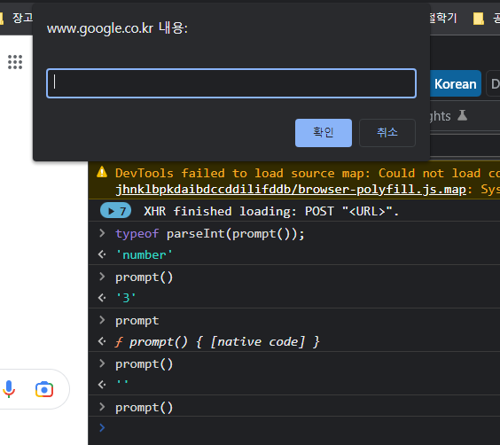

# 문자열

## 문자열 기본

- 백틱은 그냥도 줄바꿈 가능

```javascript
'', ""  은 \n 사용
```


- 따옴표 자체를 쓰고 싶을때

```javascript
'"정말" 그랬니?' //서로 반대되는 따옴표 사용
'how \'re you? //역슬래시를 써주면됨
```


## 숫자

```javascript
50000 = 5e4
0.0005 = 5e-4
//2진법
0b111 // 7
//8진법
0111 //앞에 0붙이면됨 73
//16진법
0x1a1 //417
```

- NaN
  - NaN은 타입이 number인데, 의미는 Not a Number임 ㅋㅋㅋ


- 문자열을 숫자로 파싱

```javascript
parseInt('124')
parseFloat('3.14')
Number('124')
parseInt('3월') //3
Number('3월') //NaN
//같은 기능을 두가지로 나눠서 만들었을 일은 딱히 없으니 주의
```


- prompt()




- Infinity

```javascript
2/0 //Infinity
```


- 문자열과 숫자를 합치면 형 변환(type casting)됨

```javascript
'문자열' + 0 //"문자열0" : 숫자가 문자열로 바뀜
'문자열' - 0 //NaN : 문자열에서 숫자를 빼면 Number가 적용되서 문자가 숫자가됨(*,/ 도 그럼)
```


